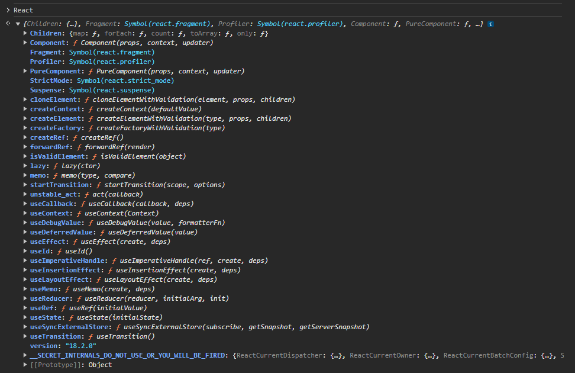
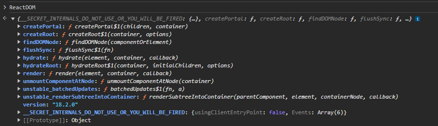
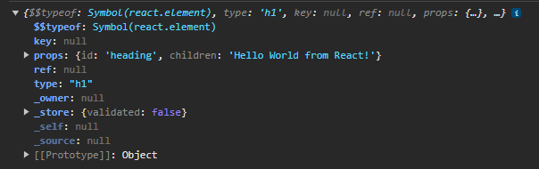
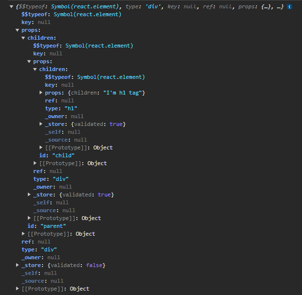
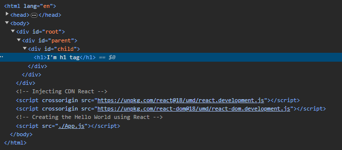
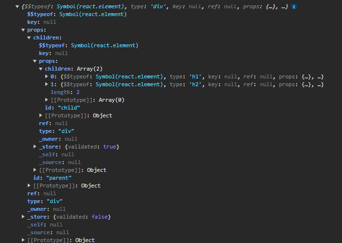
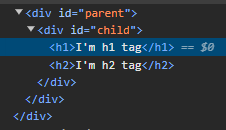
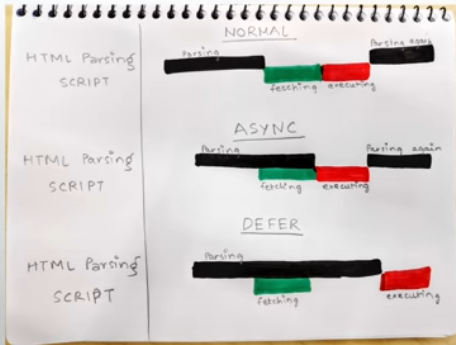

Emmet - generates code inside VSCode

How to get React into our project:
1st way: via CDN (Content Delivery Networks)
1. Google `cdn react`
2. Add the script tags just before the closing tag of body

When you go to the links
https://unpkg.com/react@18.2.0/umd/react.development.js
https://unpkg.com/react-dom@18.2.0/umd/react-dom.development.js

You will see that React is just JS!
We are just importing the scripts for React!

These are the functions/objects that the React injected in our code:
React: https://unpkg.com/react@18.2.0/umd/react.development.js (core)
- This is core of React. This can be used in web, mobile, etc. development. 

ReactDOM: https://unpkg.com/react-dom@18.2.0/umd/react-dom.development.js (for DOM operations)
- Exclusive for browsers/web development. This is like a bridge for browsers.

This two are separated because React (core) is not only exclusive for web development
(eg. React Native can be used for mobile development and is using the same React Core).

Philosophy for React
- Whenever there is something you need to do in the webpage, do it using JavaScript.
- Most costly operation: DOM Manipulation, this is what they are optimizing.

React.createElement() returns an object, not an html tag!

- props of a React element are composed of:
1. children
2. attributes

.render() method is the one converting the object return of React.createElement() to html tags

This is what a nested createElement looks like:
- As an object: 
- As an element: 

Creating element with siblings:
- As an object: 
- As an element: 

JSX
- will just make our life easy, but contrary to popular belief, we can manipulate our dom even without using JSX using the core of React!
- it's just harder and can be a messy nested code like in the above images

Order of the scripts (always):
1. React
2. ReactDOM
3. your App.js (JS File)
If you change the order of the scripts, it will not work!

Library
- Only works at a specific place, can work independently in a small place in your app.
    - React is a library!
      - It only works on wherever you delegate the root as. Not the whole html!
- You can just inject it and can be applied to an existing app. 

Framework
- The whole project is affected
- Not all frameworks can be applied to an existing app without breaking it.

Additional note on 'async' and 'defer' attribute for scripts

- 'async' does NOT guarantee order of execution! not advisable for dependent scripts (scripts dependent on other scripts)
- 'defer' guarantees and maintains order of execution!