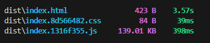
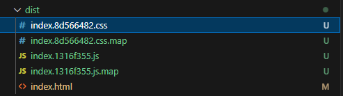

npm
- does not have a full form, not an abbreviation
- it manages packages but it does not stand for `Node Package Manager`
- standard repository for packages
- all libraries, utilities will come from npm

How to add npm in your project
1. go to your root folder
2. type in `npm init`
3. answer the questions for the details of your project
      a. package name
      b. version
      c. description
      d. entry point - App.js
      e. test command - jest
      f. git repository - your url repository for the project
      g. keywords
      h. author - yourself
      i. license - ISC
  
package.json
- config of your npm
- packages are also known as dependencies
- this is where npm will take care of the versions of your packages/dependencies

caret and tilde in package.json
- ^<version> : will automatically upgrade to all future *minor/patch* versions
- ~<version> : will automatically upgrade to all future *patch* versions

Most Important Dependency in the Project: *bundler*
- this the one packaging your app to be able to push it to production
- eg.
    - CRA (Create React App) uses the bundlers webpack and babel behind the scenes
- for our project, we will use `parcel` bundler

How to install `parcel` to our app:
1. npm install -D <package-name>
  - package-name = `parcel`
  - -D -> this is how you tell the npm that it will be a "dev dependency"

2 Types of Dependency/Package
1. dev dependencies - generally required in the development phase
2. normal dependencies - used in production also

package-lock.json
- keeps a record of your exact version you installed currently 
- even if there will be a new version available for your package, as long as you did not run npm install again, your package-lock.json will keep your last installed versions
- @integrity: -> a hash that is necessary for checking if the deployed app is the same as your local

node_modules
- contains all the code that we fetched from npm
- right now, this is all the code/dependencies that came with `parcel` package
- *transitive dependencies*
  - our project is dependent of parcel, parcel is dependent of other packages, those other packages are also dependent to other more packages... and so on.

Why put package.json and package-lock.json in git?
- package.json is for config
- package-lock.json maintaining the exact version/integrity of the dependencies in your project

But you don't need to put node_modules in git
- usually inside `.gitignore`
- as long as you have package.json and package-lock.json -> you can regenerate node_modules using `npm install` again
- whatever you can regenerate, don't put it on git!

Building our app using parcel (dev build)
1. npx parcel index.html
  
  

npm vs. npx
- npm -> installing the packages
- npx -> executing the packages

CDN Links is not a preferred way to bring React and ReactDOM into our project
- it will make network calls
- we have to keep changing the version inside the html file instead of our package.json

Installing React & ReactDOM to our project as a normal dependencies
1. npm install react
2. npm install react-dom
shortcut for `npm install` is `npm i`

type=module
- needed so we can import packages
- normal browser scripts cannot have imports

What Parcel is doing for you?
- Dev Build
- Local Server
- HMR (Hot Module Replacement) - as soon as you save the file, it will reflect your changes
- File Watching Algorithm - written in C++
- Caching - Faster Builds
- Image Optimization
- Minification for Production build
- Bundling
- Compress your files
- Consistent Hashing
- Code Splitting
- Differential Bundling - support older browsers
- Diagnostic
- Error Handling
- HTTPs
- Tree Shaking - remove unused code for you!
- Different dev and prod bundles

Creating a Prod Build
1. remove "main": App.js in package.json because we will be using index.html in parcel
2. npx parcel build index.html

Prod build is added to dist folder

the one inside the dist folder is the one we are seeing in the browser, not our code itself, these are the production ready code!
