Creating scripts
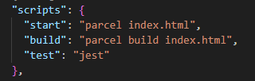

How to run your scripts:
- npm run <script-name>

Scripts with shortcut (npm <script-name>)
- start
- test

JSX
- JS Syntax for creating React Elements
- developed by Facebook developers
- not a part of React!
- goal: merge html, css, and js!
- HTML-like or XML-like syntax only! not HTML/XML in JS!

Write Code for:
1. Humans - priority!
2. Machines

Who understands JSX?
- JS Engine does not understand JSX, only EcmaScript.
- Browser console also does not understand JSX.
- Babel is the one understanding JSX! JSX code is transpiled/converted before it reaches JS Engine.

Babel
- JavaScript compiler/transpiler
- a toolchain that is mainly used to convert ECMAScript 2015+ code into a backwards compatible version of JavaScript in current and older browsers or environments
- this package is included in the modules when we installed *parcel*. One of the dependencies for parcel. 
- takes JSX and converts/transpiled it that JS Engine will understand
- not created by Facebook! (not React!)
- JSX => transpiled => React.createElement => React Element (Object) => render => DOM/HTML Element
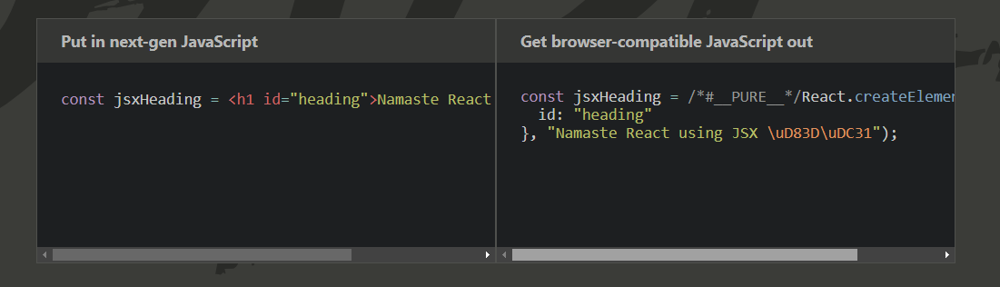

HTML VS JSX
- HTML: "class" , JSX: "className"
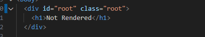
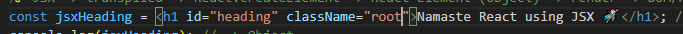
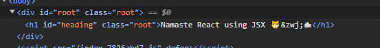

- JSX attributes -> camelCase
- JSX needs to be wrapped in parenthesis for multiline - required so Babel will know when will it stop transpiling JSX

React Components (2 Types)
1. Class Based Component = OLD
2. Functional Component = NEW

React Functional Component
- just a normal JS Function that returns a JSX Element/React Element
- just Capitalize the first letter when creating a functional component
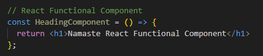
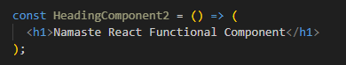
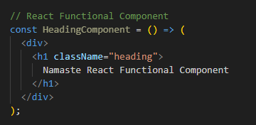

Rendering a Functional Component
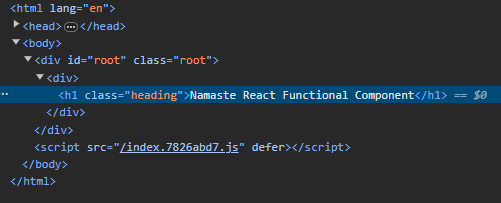
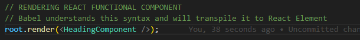

Some interviews called this "Component Composition"
- composing two or more functional components into one
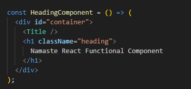

Note: you can use a normal function in writing components
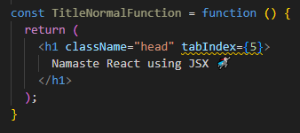

Writing JS Expressions inside the JSX Component using Curly Braces
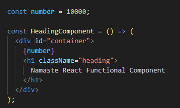
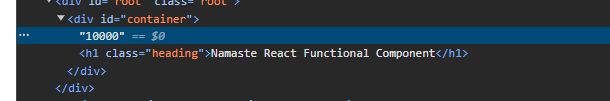
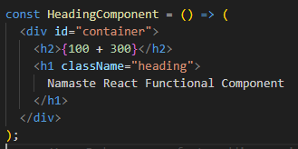

You can also write the React Element since it is also JS
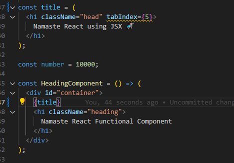
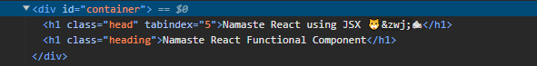
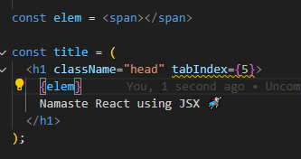

Cross-site scripting (XSS)
- attack in which an attacker injects malicious executable scripts into the code of a trusted application or website
- but JSX is so amazing that it takes care of this injection attacks! It will sanitize data before parsing it!

Two ways of writing
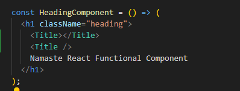

You can also call the functional component since it is a normal JS function at the end of the day (but not conventional)
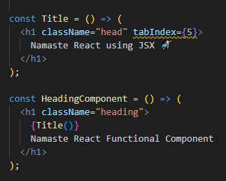

Options for the 'type' attribute in script tag
https://developer.mozilla.org/en-US/docs/Web/HTML/Element/script#attr-type