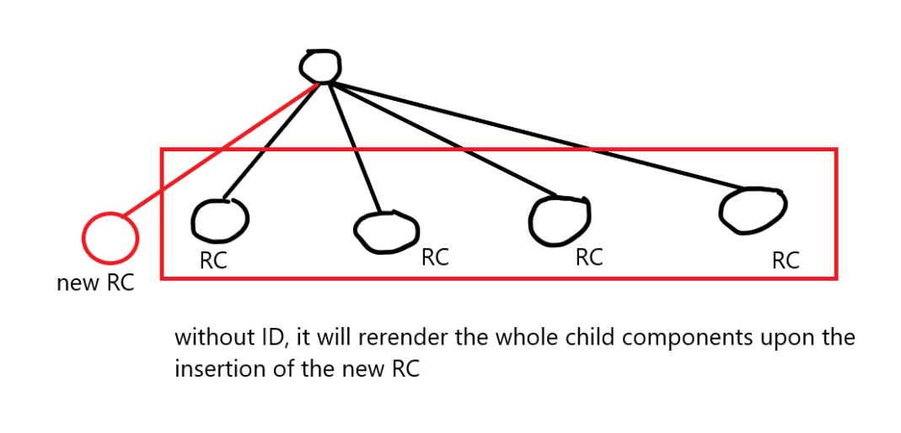

First thing: PLAN
1. UI Design/Mock even scratch - You should exactly know what you would build. How your app should look like
2. Low-level planning - what components can my app have
    -
3. Start Coding

props
- short for 'properties'
- props are just normal arguments to a function!'
- for passing dynamic data
- example: 
- passing in the functional component:
    
    


Config-Driven UI
- website is driven by data
- eg. different carousel for different locations
- sample config from backend:
```
"cards": [
  {
    "cardType": "carousel",
    "layoutAlignmentType": "VERTICAL",
    "data": {},
    "parentWidget": false
  },
  {
    "cardType": "carousel",
    "layoutAlignmentType": "VERTICAL",
    "data": {},
    "parentWidget": false
  },
  {
    "cardType": "seeAllRestaurants",
    "layoutAlignmentType": "VERTICAL",
    "data": {},
    "parentWidget": false
  }
]
```

Cloudinary
- a CDN for image hosting

key in mapped component
- should always have a key property whenever you are looping in an array and returning a functional component (mapping)
- key={<unique identifier>}
- important for sorting, for rerendering optimization

- React will know that the component is already existing if there is a key to prevent double rendering
- DO NOT USE `index` (2nd property of the map array) as key! https://dev.to/shiv1998/why-not-to-use-index-as-key-in-react-lists-practical-example-3e66


ASSIGNMENTS
● Is JSX mandatory for React?
  - No, you can use plain React.createElement but JSX makes your life easier.
● Is ES6 mandatory for React?
  - No, there is a create react class that we can use: https://www.geeksforgeeks.org/react-js-without-es6/
● {TitleComponent} vs {<TitleComponent/>} vs
{<TitleComponent></TitleComponent>} in JSX
  - The first one returns an Object (React Component Object), the second and the third one is the same, it will return an already rendered React Component
  - Although the 3rd one can accept child components (nested components inside it)
● How can I write comments in JSX?
  - {/*  */}
● What is <React.Fragment></React.Fragment> and <></> ?
  - allow you to wrap or group multiple elements without adding an extra node to the DOM
  - can be useful when rendering multiple child elements/components in a single parent component
● What is Virtual DOM? (https://legacy.reactjs.org/docs/faq-internals.html)
  - programming concept where an ideal, or “virtual”, representation of a UI is kept in memory
  - Since “virtual DOM” is more of a pattern than a specific technology, people sometimes say it to mean different things.
  - In React world, the term “virtual DOM” is usually associated with React elements since they are the objects representing the user interface.
● What is Reconciliation in React? (https://legacy.reactjs.org/docs/faq-internals.html)
  - The virtual DOM (VDOM) is a programming concept where an ideal, or “virtual”, representation of a UI is kept in memory and synced with the “real” DOM by a library such as ReactDOM.
      - reconciliation https://legacy.reactjs.org/docs/reconciliation.html
        - The algorithm React uses to diff one tree with another to determine which parts need to be changed.
      - update
        - A change in the data used to render a React app. Usually the result of `setState`. Eventually results in a re-render.
● What is React Fiber? https://github.com/acdlite/react-fiber-architecture
  - internal objects called “fibers” to hold additional information about the component tree
  - part of “virtual DOM” implementation in React
  - Fiber is the new reconciliation engine in React 16. Its main goal is to enable incremental rendering of the virtual DOM.
● Why we need keys in React? When do we need keys in React?
  - see notes above
● Can we use index as keys in React?
  - no we can't. 
  - https://dev.to/shiv1998/why-not-to-use-index-as-key-in-react-lists-practical-example-3e66
  - can be a problem when sorting, filtering, etc.
● What is props in React?
  - see notes above
● What is a Config Driven UI ?
  - see notes above