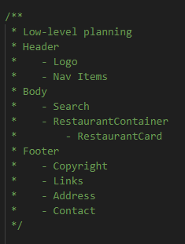

First thing: PLAN
1. UI Design/Mock even scratch - You should exactly know what you would build. How your app should look like
2. Low-level planning - what components can my app have
    -
3. Start Coding

props
- short for 'properties'
- props are just normal arguments to a function!'
- for passing dynamic data
- example: 
- passing in the functional component:
    
    


Config-Driven UI
- website is driven by data
- eg. different carousel for different locations
- sample config from backend:
```
"cards": [
  {
    "cardType": "carousel",
    "layoutAlignmentType": "VERTICAL",
    "data": {},
    "parentWidget": false
  },
  {
    "cardType": "carousel",
    "layoutAlignmentType": "VERTICAL",
    "data": {},
    "parentWidget": false
  },
  {
    "cardType": "seeAllRestaurants",
    "layoutAlignmentType": "VERTICAL",
    "data": {},
    "parentWidget": false
  }
]
```


Cloudinary
- a CDN for image hosting