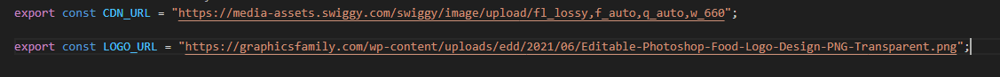
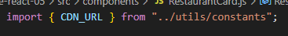

Best practice
1. separate files for separate components
2. create `src` folder (convention) and put App.js there (and future components) but this is just optional.
it is up to the developer or the team to structure project folders
guide: https://legacy.reactjs.org/docs/faq-structure.html#grouping-by-features-or-routes
3. if you name a file, match the exact name of the component (convention only depends on the team/dev)
4. `utils` folder for constants, mock data etc.
5. Whenever you have hard-coded data, never keep it in your components file. (constants files)
6. Name your constants into capital letters, snake case

Note: files can be of extension .jsx but for this project we will follow .js for all

How to export:
1. Default Export: `export default <ComponentName>` (1 default export per module only)
  - standard for components!
2. Named Export: `export const <variableName>`
  - if in one file, you need to export multiple things
  - sample : 

Export first before you can import your component
1. Default import `import <ComponentName> from "path/<Filename>"`
  - standard for components!
2. Named import `import { <importname> } from "path/<filename>"`
  - sample : 