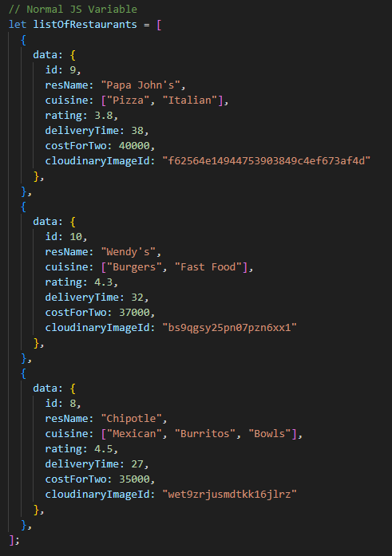
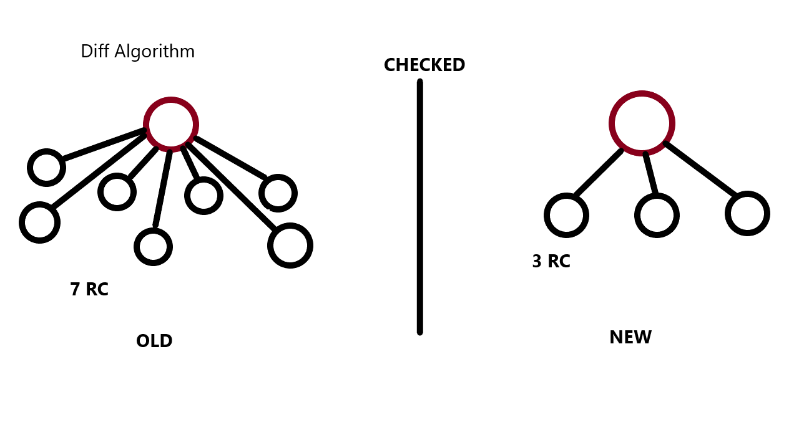

Best practice
1. separate files for separate components
2. create `src` folder (convention) and put App.js there (and future components) but this is just optional.
it is up to the developer or the team to structure project folders
guide: https://legacy.reactjs.org/docs/faq-structure.html#grouping-by-features-or-routes
3. if you name a file, match the exact name of the component (convention only depends on the team/dev)
4. `utils` folder for constants, mock data etc.
5. Whenever you have hard-coded data, never keep it in your components file. (constants files)
6. Name your constants into capital letters, snake case

Note: files can be of extension .jsx but for this project we will follow .js for all

How to export:
1. Default Export: `export default <ComponentName>` (1 default export per module only)
  - standard for components!
2. Named Export: `export const <variableName>`
  - if in one file, you need to export multiple things
  - sample : 

Export first before you can import your component
1. Default import `import <ComponentName> from "path/<Filename>"`
  - standard for components!
2. Named import `import { <importname> } from "path/<filename>"`
  - sample : 

UI Will not change when you just use variables like this

This in turn will be the use for hooks
# React Hooks
- React hooks are a NORMAL JS Utility Functions which is given to us by React!
- from React import (as a named import)
- how to use it? import from React!

2 most important hooks
1. useState() - super powerful state variables in React
  - whenever a state variable changes, react will rerender the component
  - keeps ui layer in sync with data layer
  - returns an array
  - its setState is the only one who can trigger the Reconciliation Algorithm!
2. useEffect()

Why React is fast?
- because it has efficient DOM manipulation by building the Reconciliation Algorithm (Diff algorithm) over Virtual DOM

# Reconciliation Algorithm (aka. React Fiber)
- React 16
- in React 18, called React Fiber
- uses Diff algorithm (like in Git)

# Virtual DOM
- not an actual DOM! (opening/closing tags...etc)
- only representation of an actual DOM
- React create element produces an OBJECT, and this keeps the Virtual DOM with it!
- a normal JS Object!

# Diff Algorithm
- find difference between old Virtual DOM and new Virtual DOM, update the DOM in every render cycle
- since Virtual DOM is an Object! just like a diff in git!

# Incremental Rendering
- ability to split rendering work into chunks and spread it out over multiple frames
