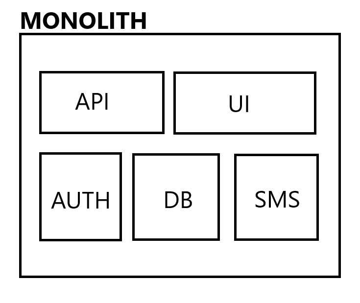
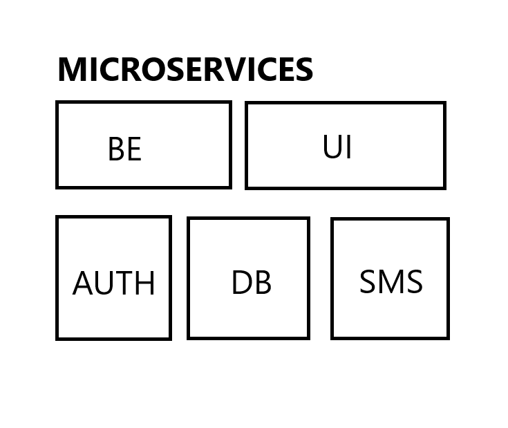
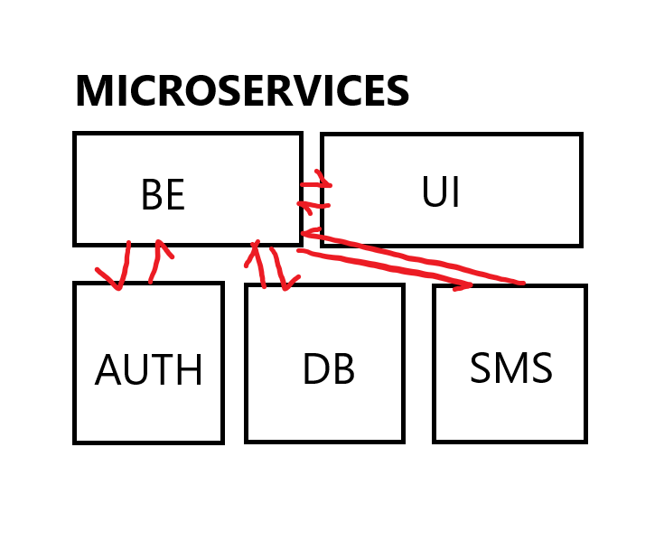
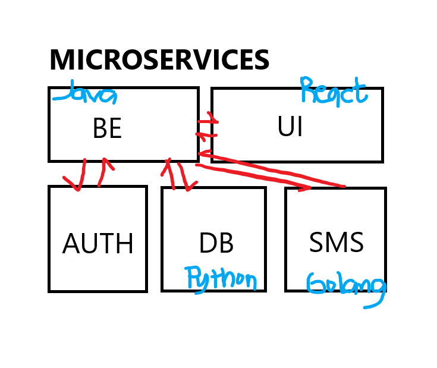
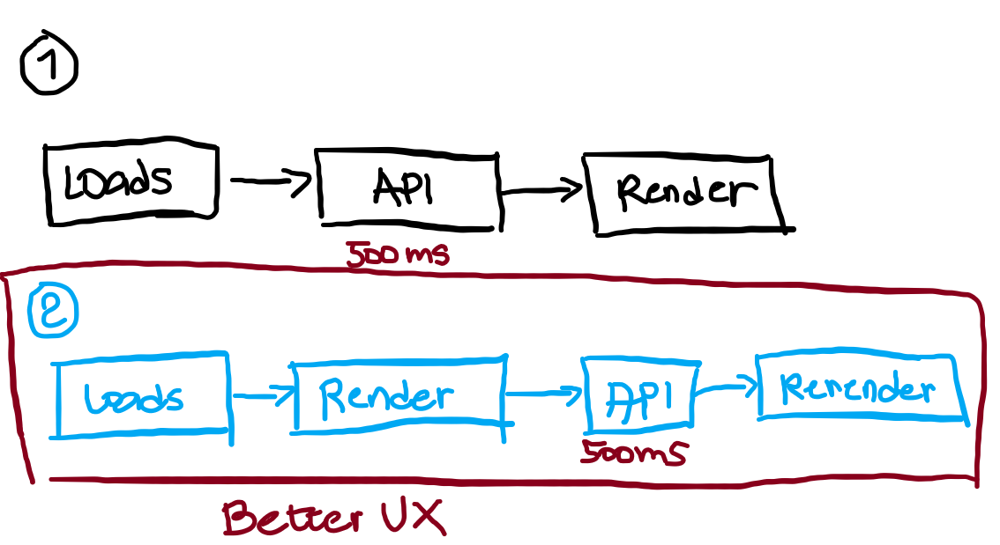

Monolith Architecture
- all code are inside one project

Microservices
- different small projects work together as a whole
- has separation of concerns and single responsibility principle
- each of the service has its single responsibility

- can also have different language using

- can also run on their own specific ports
- eg. :1234 - UI Service, :1000 - BE, :3000 - SMS

- different ports can also be deployed differently in their own domain name
- eg: / -> UI, /api -> BE, /sms -> SMS

2 Approaches to fetch data from BE

- number 2 approach is better in React, and we will always use this in React
- even if it has rerender, React can handle this very fast!
- number 2 also has better UX