React Router DOM
- npm i react-router-dom

Creating routes
1. Create routing configuration on the root file
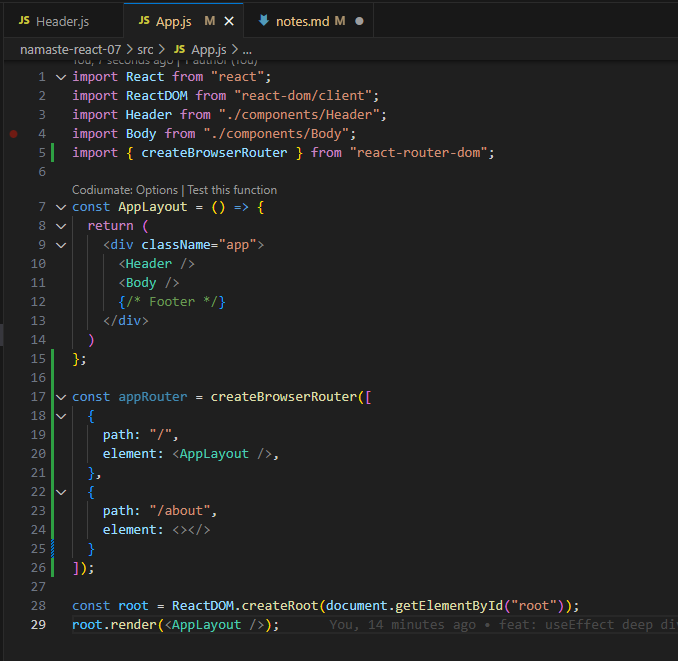
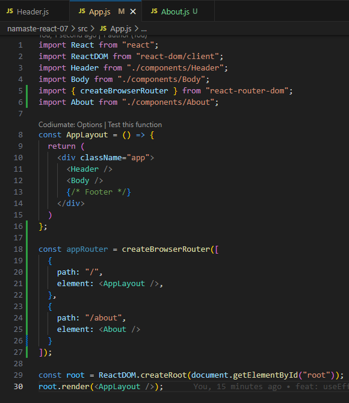
2. Render the Router Provider from react-router-dom to use your routing configuration
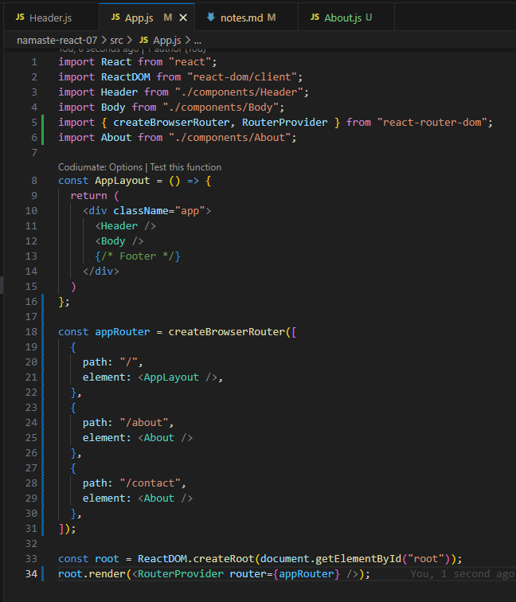

When there is no path that is provided in your configuration:
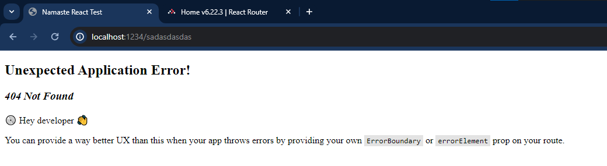
- react-router-dom provides this error page for you

Creating your own error page
1. create error page component
2. add errorElement on the object inside the routing configuration
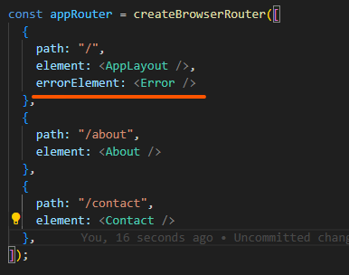
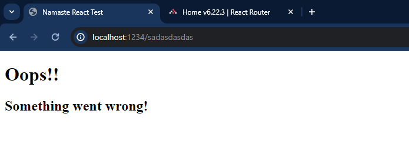

useRouterError
- Important hook provided by react-router-dom to provide more details about the error
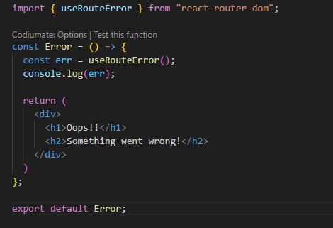
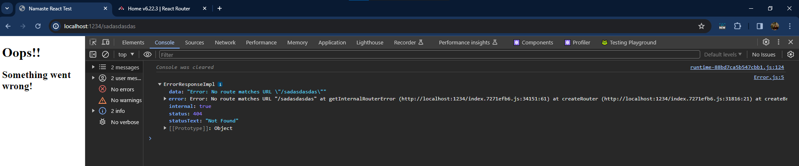

Children Routes
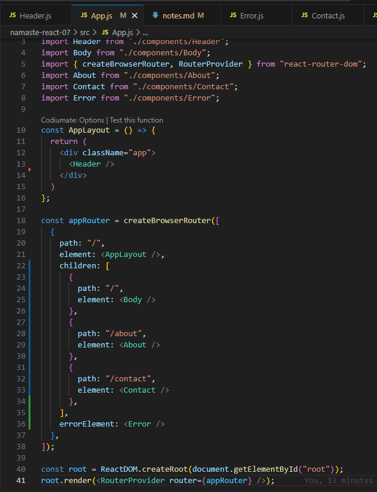

How to use these children routes? 
1. import Outlet component from react-router-dom
2. add the Outlet inside your AppLayout component
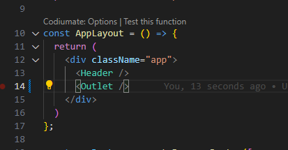
3. Whenever this is rendered, it will render the children components depending on the path
Note: Outlet will not be seen in your HTML. only the component that the outlet has rendered based on the path.

Creating a link for redirecting to the paths using react-router-dom
Note: do not use <a> tags! because the whole page is refreshing just to navigate to that. You can navigate to a path without refreshing/reloading the page using react-router-dom
1. import Link component from react-router-dom
2. wrap the item you want to add link to, 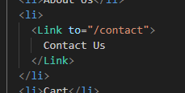 -> it will not reload the page! it's just changing the components!
- This is why React built websites are called Single Page Application
- it's a whole single component, and all the changes are just component conditional rendering changes. it is not reloading the page! only the components are changing.

# 2 types of Routing in Web Apps
2 types of routing in your web app
1. Client Side routing - components already loaded in the app, and just loads the component whenever necessary
2. Server Side routing - reloading the whole page, sends a network call to the path you called to fetch the html from the server, and renders it to the page