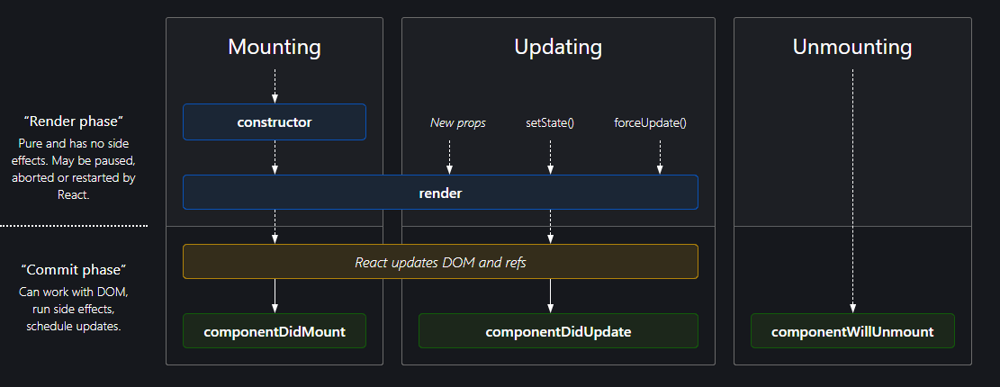

Class-Based Component
- normal JS Class
- extends React.Component -> in this way, react will be able to tell that your class is a component
- class with render method that returns JSX

Functional VS Class Based

Passing Props
- same as functional component

Accessing props
- using constructor
- always have to write super(props)
- The purpose of using the super constructor with a props argument is to inherit the properties of the parent class and also pass in additional properties as arguments to the child class.

- this.props.<prop-name>

We can also destructure the props inside the render function

Creating States
- also created inside constructor
- using `this.state = {}` object

Accessing States
- this.state.<state-name>
- with destructuring:

Multiple States
- all states should be inside the this.state object
-

Updating States
- this.setState(<object of the updated state variables>)
- only the key-value pair in the object passed inside the setState will be updated
- all other key-value pair will not be touched.

componentDidMount() {} method
- once the component is rendered, this one will be called
- life cycle of parent and child components:

- only when the children components are done mounted (all componentDidMount() of the children are called)
- then the parent component will be done mounting (componentDidMount() of the parent will be called)

use cases for componentDidMount()
- to make API calls after mounting components

Life Cycle with Multiple Children
1. Parent Constructor
2. Parent Render
    a. Child 1 Constructor
    b. Child 1 Render
    c. Child 2 Constructor
    d. Child 2 Render

    <DOM UPDATED - IN SINGLE BATCH>
    e. Child 1 componentDidMount()
    f. Child 2 componentDidMount()
3. Parent componentDidMount()
- This is the order because React is optimizing!

- it will first finish all the render phase of the children (batching)

DOM Manipulation
- most expensive process in React