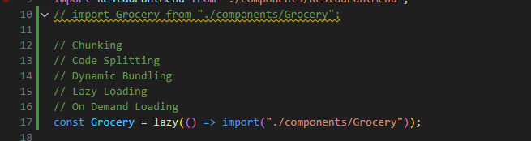
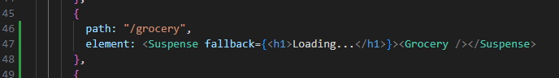

Single Responsibility Principle
- one function = one purpose only

Modularity
- breaking into smaller components
- can lead into Reusable, Maintainable, Testable

Hooks
- is just a utility function but they are helper functions

App Chunking
- Code Splitting
- Dynamic Bundling
- Lazy Loading
- On Demand Loading
- to break down the js file app (index.js) into smaller chunks so that it will not load the whole code base at once
- example: bundle per module (eg. for a travel app, one bundle for flights, one bundle for hotels, one bundle for homestays)

How to do this in React

import { lazy, Suspense } from "react";
https://react.dev/reference/react/lazy
https://react.dev/reference/react/Suspense
Lazy with Suspense (because lazy is a Promise and it needs the suspense to prevent errors)

