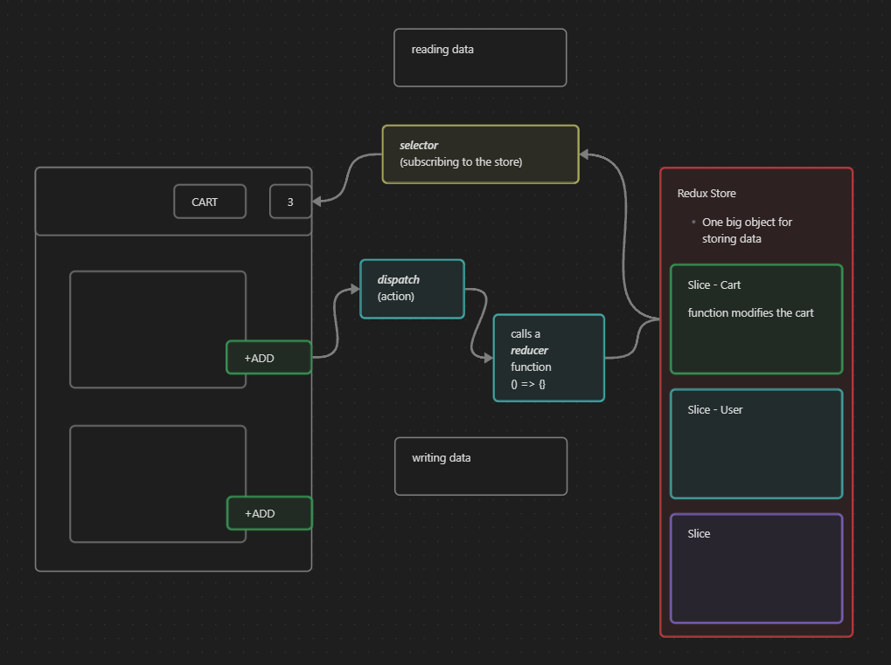

Note:
- Redux is not mandatory.
- for large scale applications (for many read-write operations)

Redux
- has redux dev tools in chrome

# How Redux Work

# Redux Toolkit
- Install @reduxjs/toolkit and react-redux
- Build our store
- Connect our store to our app
- Slice (cartSlice)
- Dispatch (action)
- Selector

# Important notes in subscribing
- Make sure that you only select what you need!

<!-- More Efficient -->
const cartItems = useSelector((store) => store.cart.items);

<!-- 
  Less Efficient - subscribe to the whole store, 
  any change in store will be read by this!,
  the component that is subscribed here 
  will also be updated even if the change is not for them 
-->
const store = useSelector((store) => store);
const cartItems = store.cart.items;

- `reducer` and `reducers` keyword
reducer is for the whole store
reducers are for slices

# Redux uses Immer package for abstracting the old implementation
https://immerjs.github.io/immer/